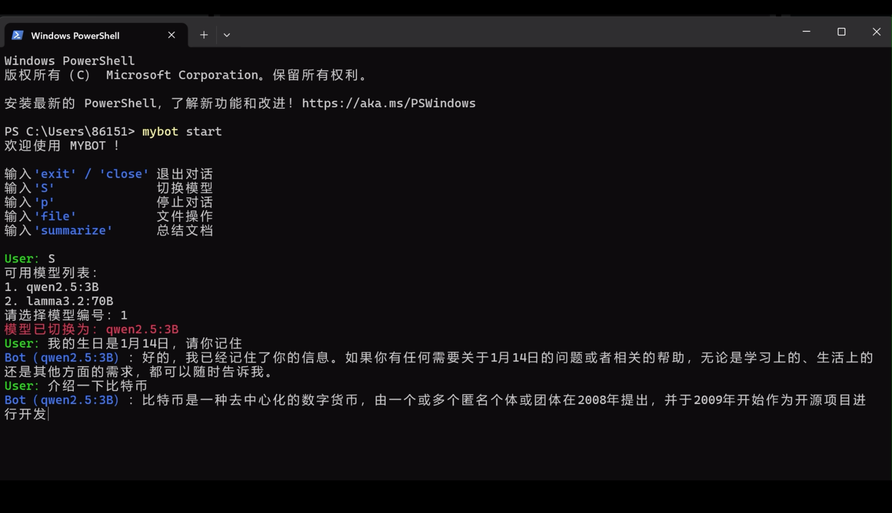
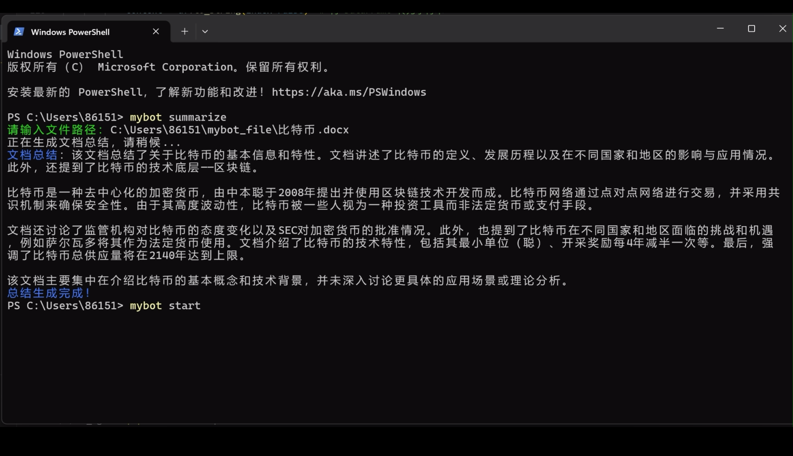
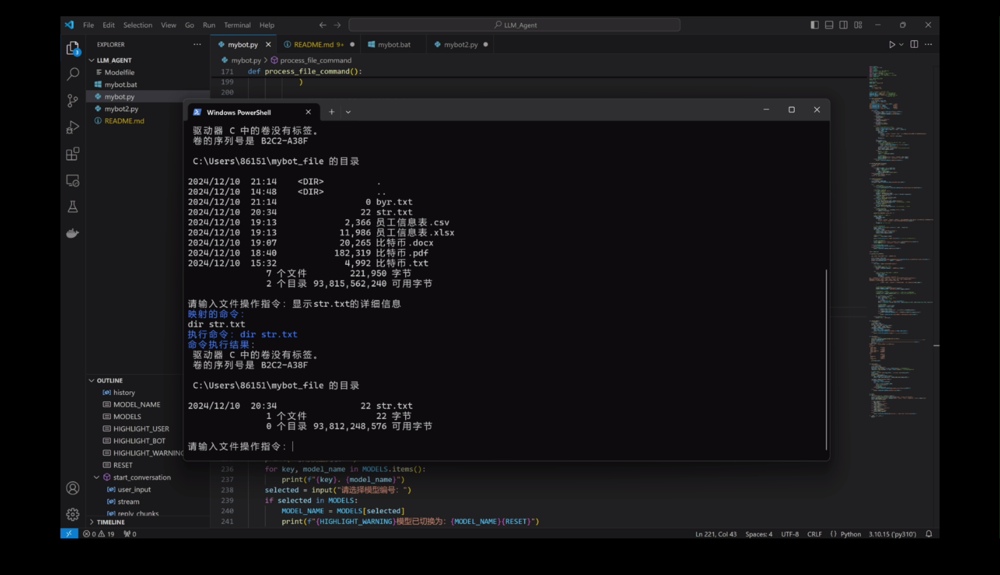
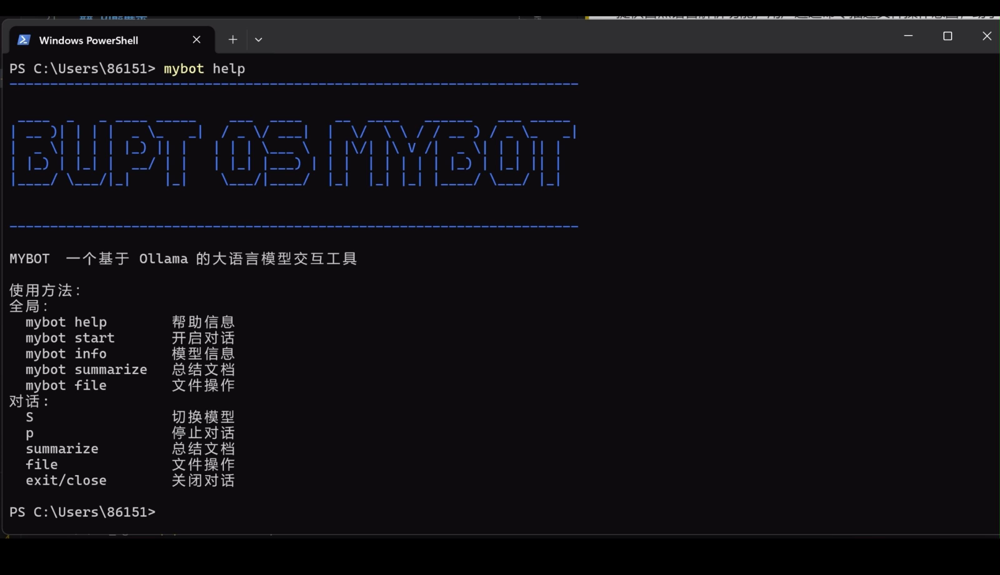
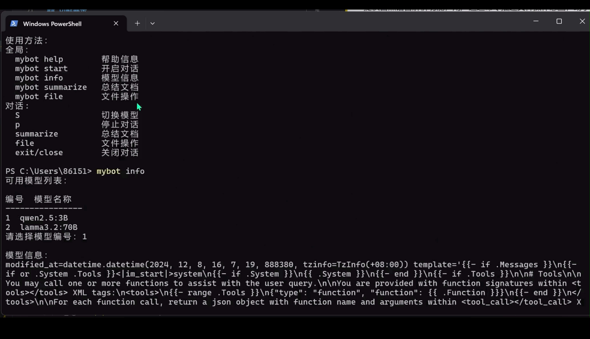

# BUPT OS MYBOT项目文档

## 功能介绍

#### 使用说明：
```
全局：
  mybot help        帮助信息
  mybot start       开启对话
  mybot info        模型信息
  mybot summarize   总结文档
  mybot file        文件操作
对话:
  S                 切换模型
  p                 停止对话
  summarize         总结文档
  file              文件操作
  exit/close        关闭对话
```

## 功能展示

#### 对话：
支持长文本人机对话与流式交互相应。
支持历史记忆。
支持模型切换（qwen2.5:3B 和 lamma3.2:70B）。
支持中断会话。
支持历史会话管理。
**演示：**



#### 文档总结：
支持对多种文件格式（**PDF**、**Word**、**Excel**、**CSV**）的内容提取，并生成文档总结或数据分析。
支持全局和对话调用。
**演示：**


#### 文件操作：
提供自然语言解析功能，用户通过命令描述文件操作意图，助手将其映射为终端命令并执行。
支持全局和对话调用。
**演示：**


#### 模型管理：
支持查看和切换当前使用的模型。
**演示：**


#### 帮助信息：
通过命令 help 显示工具的使用说明及功能指南。
**演示：**


#### 模型信息：
反馈模型列表，可查看每一个模型的模型信息。
**演示：**


---
## 配置步骤

#### 平台：
```
Windows 11 PowerShell
```
（Ubuntu好像也行，不过代码中的promote专为为Windows设计，需修改）

#### 环境：
环境依赖：详见requirements.txt

#### 步骤：
1. 下载[Ollama](https://ollama.com/)
2. 根据机器存储，选择合适的本地模型，使用ollama命令
```
ollama pull model_name
```
3. 选择一个conda环境，安装依赖
```
pip install requirements.txt
```
4. 编辑mybot.bat批处理文件，替换掉.py项目路径和conda解释器路径
```
@echo off
call "C:\Users\86151\anaconda3\condabin\conda.bat" activate py310
python "C:\E\LLM_Agent\mybot.py" %*
```
5. 配置环境变量
```
->windows系统
->高级系统设置
->编辑Path环境变量
->添加项目地址
```
6. 编辑Modelfile客制化你的模型！
```
FROM qwen2.5:3b
# 设定温度参数为1 [更高的更具有创新性，更低的更富有连贯性]
PARAMETER temperature 1
# 将上下文窗口大小设置为4096，这控制着LLM能够使用多少个token来生成下一个token。
PARAMETER num_ctx 4096
```
7. `mybot help`正确显示说明配置成功

---
